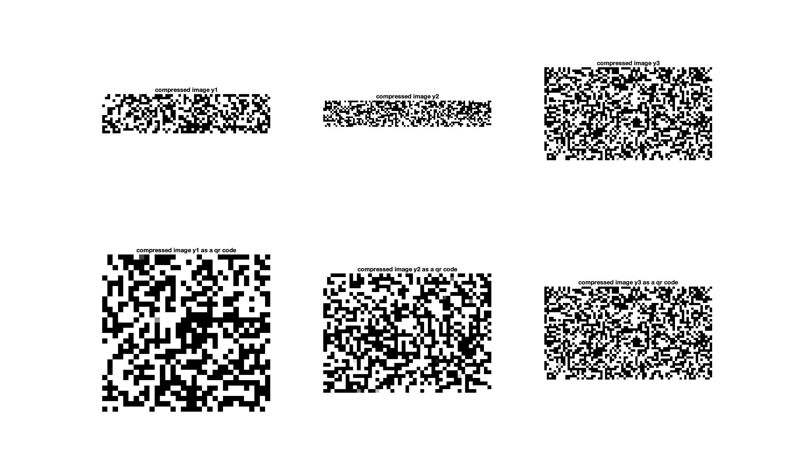
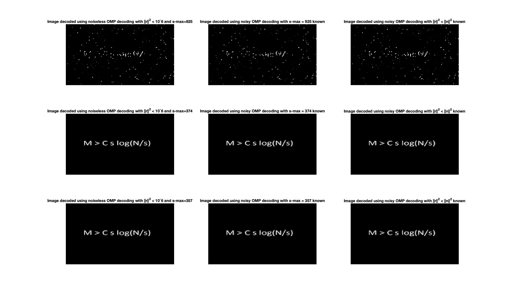

# Finding Sparse Solutions via Orthogonal Matching Pursuit (OMP)

This is a implementation of Orthogonal Matching Pursuit algorithm for finding sparse solutions, which is a fundamental method for signal processing and signal compression.

The sparse approximation problem aims to find the sparsest representation of signal from a redundant dictionary.

This implementation contains a series of experiments:
1. Sparse approximation with noiseless signal
2. Sparse approximation with noisy signal and known s
3. Sparse approximation with noisy signal and known noise
4. Sparse approximation for noisy image compression and reconstruction

- [Project Experiment](./MiniProject_2.pdf)

## Signal approximation and Image reconstruction Result 

- Compressed Images

- Recovered Images

More details shown in the [report](Report/ECE269MiniProject2Report.pdf)